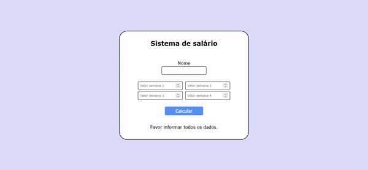

<h1 align="center">Sistema de Salário</h1>

Uma calculadora de salários sob comissão com o uso de porcentagens

  

 

## Sobre

Este trabalho avaliativo de PHP da disciplina de Programação Web II envolve o cálculo de salários, utilizando porcentagens no contexto de ganhos sob comissão.

## A atividade

Todos os vendedores de uma loja possuem um salário mínimo de R$ 1927,02 e, com a nova implementação de um sistema de meritocracia, todos possuem uma meta de vendas semanais de R$ 20.000 (R$ 80.000 por mês), que é adicionada ao salário mínimo.

- Todas as semanas que alcançaram R$ 20.000 em vendas recebem 1% do valor das vendas;
- Todas as semanas que ultrapassaram R$ 20.000 recebem 1% de 20.000 + 5% do excedente;
- Semanas que não alcançaram R$ 20.000 não recebem bônus.

Caso a meta de todas as semanas tenha sido alcançada, um bônus de 10% sobre o excedente do mês é aplicado. Caso apenas 1 semana não tenha alcançado a meta de R$ 20.000, o bônus do mês não é aplicado.

Ao final, o programa exibe na tela o salário que o vendedor receberá no mês, com base nos valores introduzidos.

## Tecnologias utilizadas

- ✅ PHP
- ✅ HTML
- ✅ CSS

## Fontes consultadas

- [Governador confirma novo Piso Regional do Paraná](https://www.aen.pr.gov.br/Noticia/Maior-do-Brasil-governador-confirma-novo-Piso-Regional-que-vai-de-R-18-mil-R-21-mil) (Agência Estadual de Notícias)
- [foreach - Manual](https://www.php.net/manual/pt_BR/control-structures.foreach.php) (PHP)
- [PSR-12: Extended Coding Style](https://www.php-fig.org/psr/psr-12/) (PHP-FIG)